## Инструкция по подключению БД

Сначала просто регистрируемся

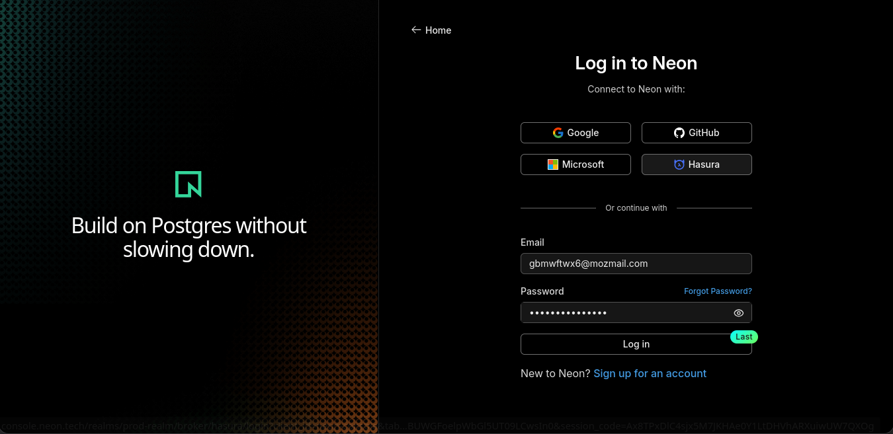

создаем новый проект

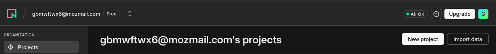

задаем любое название, версия Postgres 17, поставщик - AWS, 
регион - Франкфурт

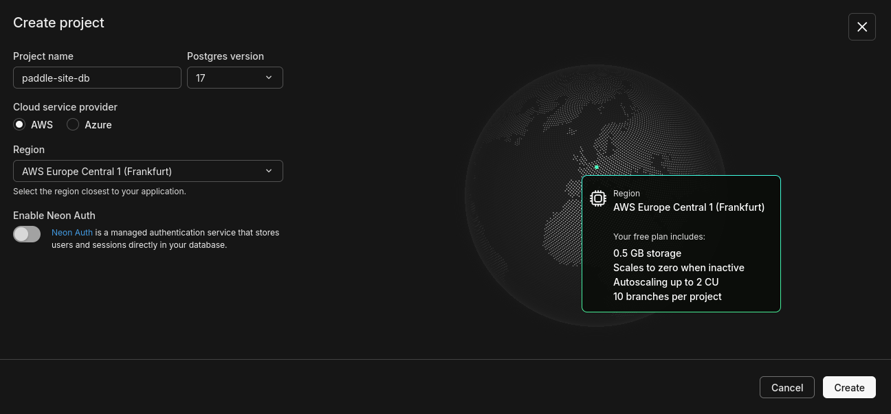

Выбираем подключиться

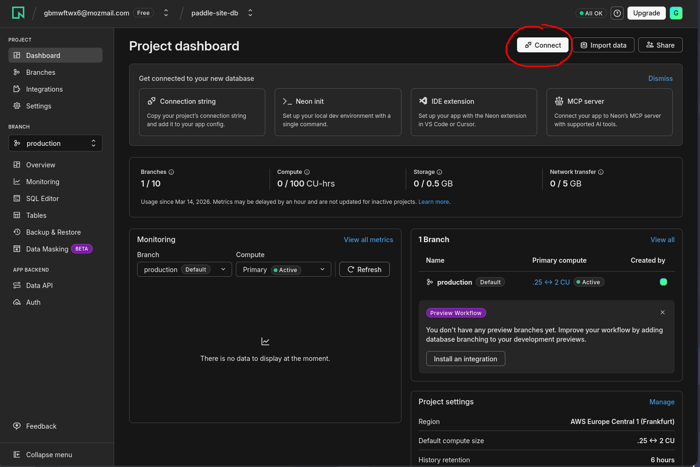

Копируем выданную нам строку

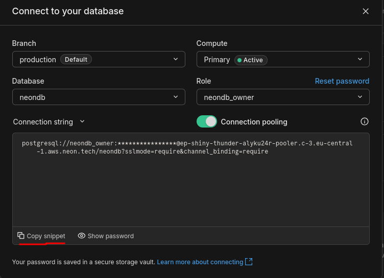

Внимание, эта строка содержит пароль доступа к этой базе данных. Если вы ее случайно раскроете кому-то не тому, последствия могут быть плохими. Считайте, что это пароль

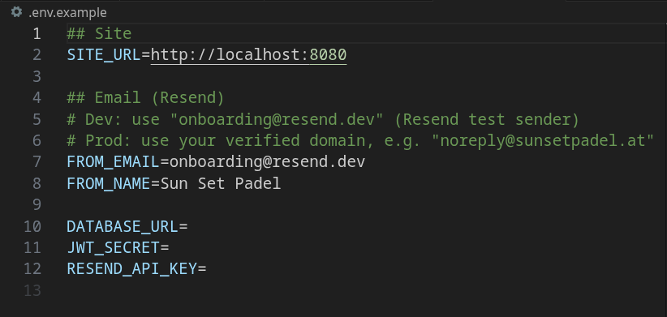

Добавляем эту строку в файл `.env.example` в поле `DATABASE_URL=`
также нужно изменить строку `SITE_URL=http://localhost:8080` на
`SITE_URL=` и добавить полное название вашего сайта со всем доменом.

Это нужно, чтобы в отправляемых письмах была ссылка на сайт, а также для токенов верификации юзеров.

Да, `FROM_EMAIL` тоже стоит поменять, там выше комментарий об этом.

Затем придумайте любое секретный набор символов на английском и напишите в `JWT_SECRET=`, например, `dfbkyjmcbperhnshrbcgvqweweibnxcmvotyebfqdfkghotyu` или `padelSiteJWTtoken_productionVersion`, задача, чтобы эта строка была максимально хаотичной, с ее помощью кодируются данные, передаваемые от сайта к пользователю.

И, соответственно, ваш ключ от `Resend` в последней строке.
В случае чего, смело просите клод код в помощи, ну или пишите мне, я постараюсь ответить сразу. Далее это дело, как и в прошлый раз, загружаете сюда:

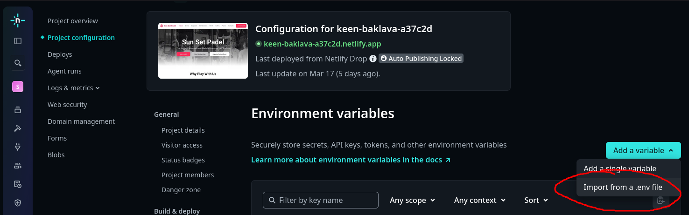

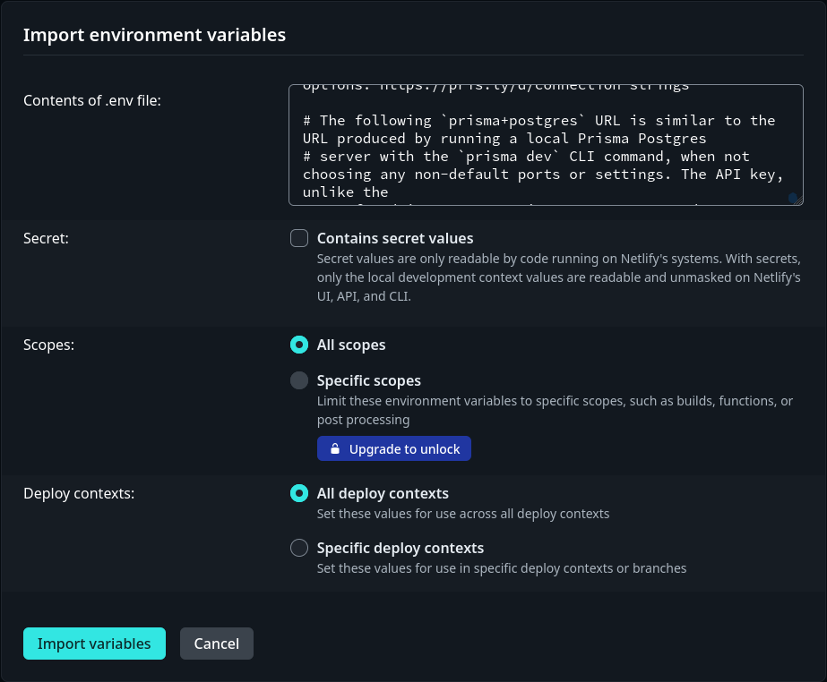

Еще раз повторюсь, каждая строка отсюда, ну, кроме имени отправителя, пожалуй, является секретной. Не комитьте это дело, храните эти данные отдельно. Файл `.env.example` можно будет переименовать как `.env`, тогда он не будет отображаться при создании коммитов гит.

Теперь можно как обычно развернуть весь сайт.

---

Пара полезных, но необязательных вещей:

- Можете запустить мою версию сайта параллельно основному сайту, чтобы проверить все и настроить как я укажу далее.
- На сайте console.neon.tech открыть вкладку Settings, найти параметр Instant restore и поставить 10-15 дней на хранение бекапов - это позволит откатить версию базы данных в случае ошибок. Это важная и полезная практика.

---

Регистрируемся на нашем сайте и переходим в консоль neon.tech

Выбираем наш аккаунт и подтверждаем его `SUPER_ADMIN` роль в выпадающем списке, сохраняем

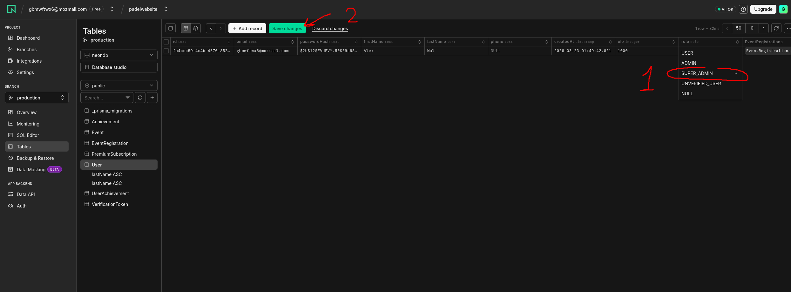

Теперь наш аккаунт является админским

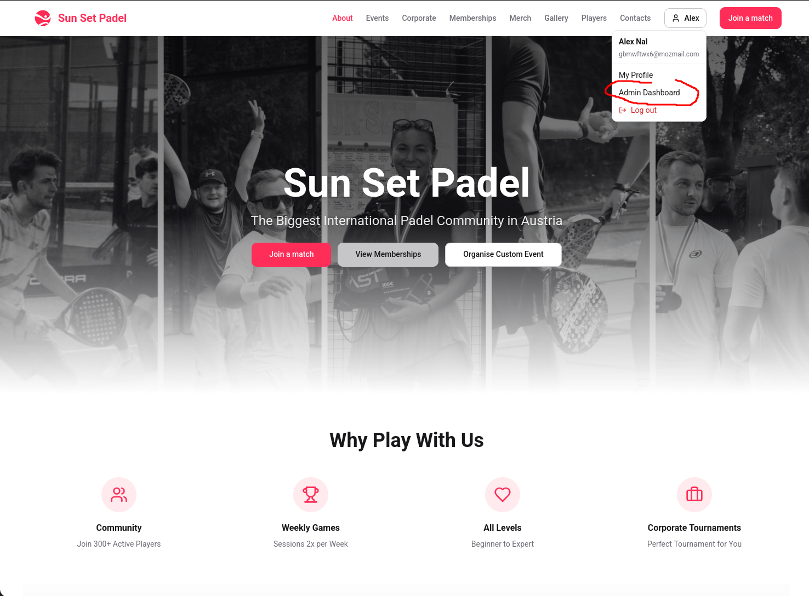

Весь функционал сохранен, а также добавлен премиум по кнопке:

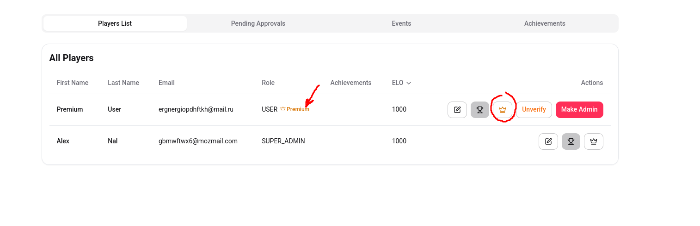

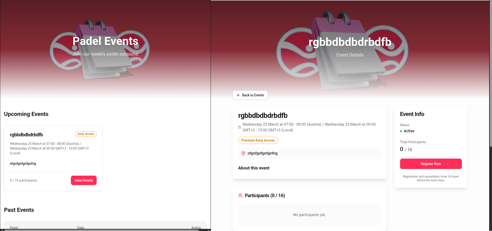